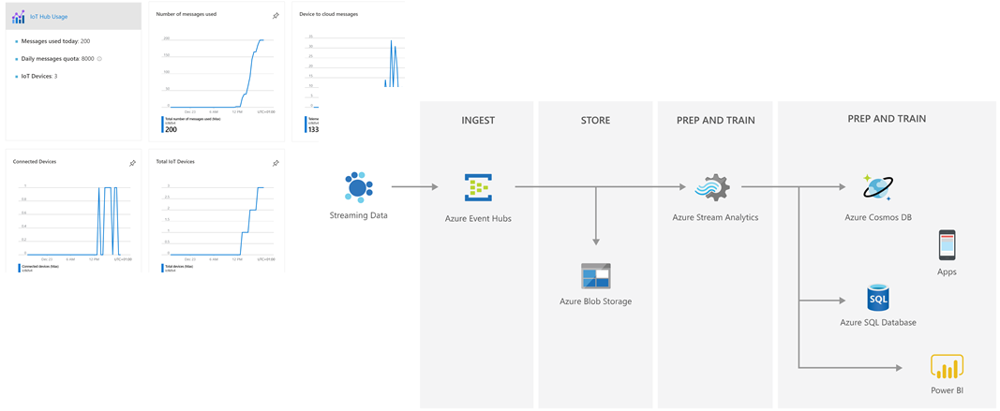
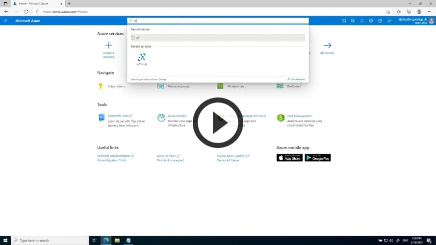
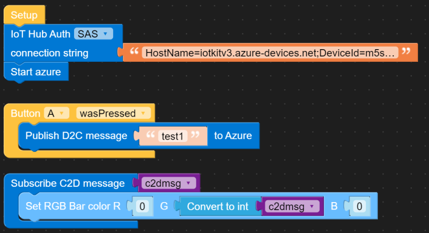
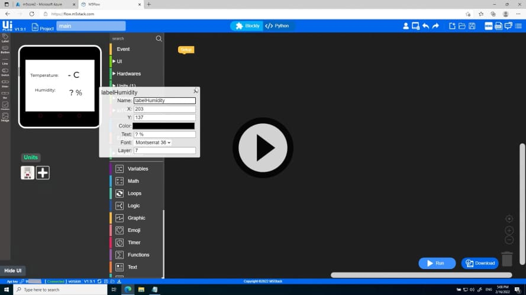
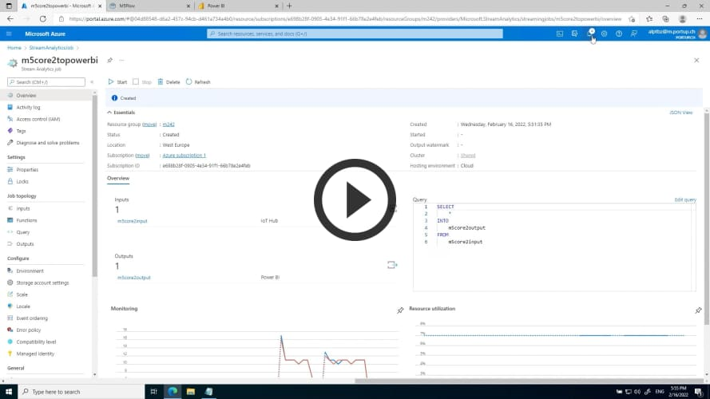
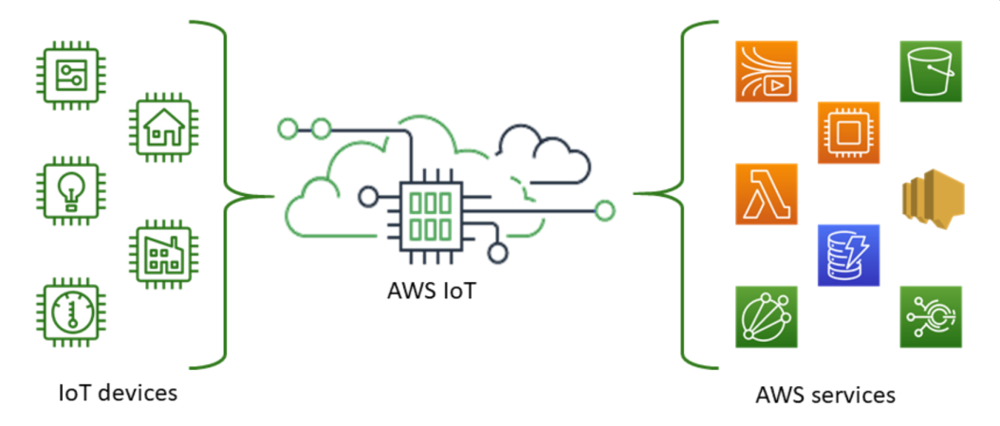
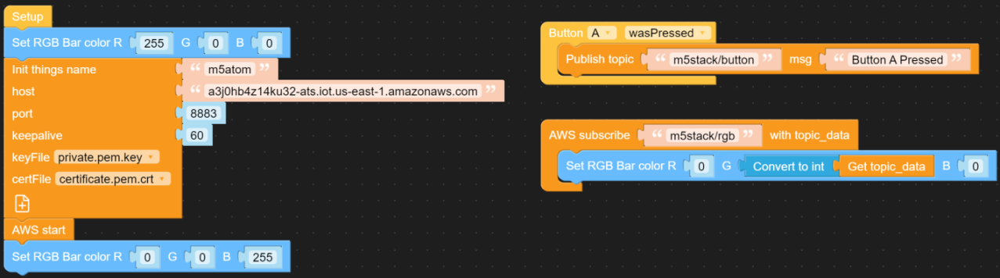
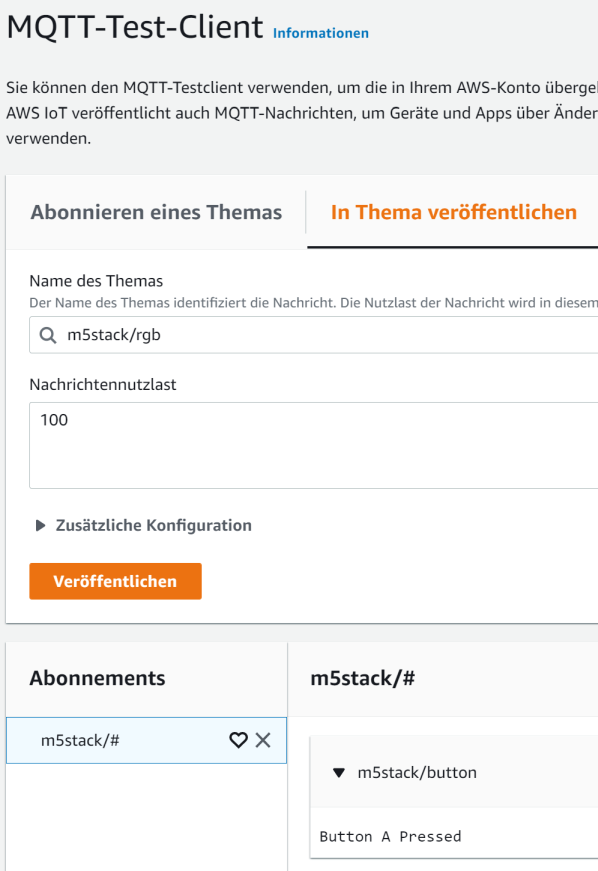

Cloud IoT Services
==================

Cloud Anbindung an Amazon (AWS), Google und Microsoft (Azure)

## Azure IoT
***

Quelle: https://docs.microsoft.com/de-de/azure/iot-hub/about-iot-hub
- - - 

IoT Hub ist ein in der Cloud gehosteter, verwalteter Dienst, der als zentraler Nachrichtenhub für die bidirektionale Kommunikation zwischen Ihrer IoT-Anwendung und den Geräten dient, die von der Anwendung verwaltet werden. Sie können Azure IoT Hub verwenden, um IoT-Lösungen mit zuverlässiger und sicherer Kommunikation zwischen Millionen von IoT-Geräten und einem in der Cloud gehosteten Lösungs-Back-End zu erstellen. Sie können praktisch jedes Gerät mit IoT Hub verbinden.

IoT Hub unterstützt die Kommunikation sowohl vom Gerät an die Cloud als auch von der Cloud an das Gerät. IoT Hub unterstützt mehrere Messagingmuster wie z.B. Gerät-zu-Cloud-Telemetrie, Dateiuploads von Geräten und Anforderungs-Antwort-Methoden zum Steuern der Geräte über die Cloud. Die IoT Hub-Überwachung unterstützt Sie dabei, die Integrität Ihrer Lösung sicherzustellen, indem Ereignisse wie Geräteerstellung, Geräteausfälle und Geräteverbindungen nachverfolgt werden.

Azure IoT Hub unterstützt folgende Protokolle:
* HTTPS
* AMQP
* AMQP über WebSockets
* MQTT
* MQTT über WebSockets

Das Azure IoT Beispiel wurde mit folgenden  Main Controllers getestet:
* [ATOM Lite](https://docs.m5stack.com/en/core/atom_lite)

### Einrichten eines Azure IoT Hub-Kontos

Befolgen Sie die offizielle Dokumentation von Azure IoT Hub:

* Erstellen Sie einen neuen Hub im Azure-Portal ([Dokumentation](https://docs.microsoft.com/en-us/azure/iot-hub/iot-hub-create-through-portal#create-an-iot-hub)). Für dieses Beispiel benötigen Sie einen Standard- Tier- Hub, um Cloud-to-Device-Nachrichten zu aktivieren. Dazu reicht die kostenlose Variante (Free Tier).
* Registrieren Sie ein neues Gerät bei dem von Ihnen erstellten Hub ([Dokumentation](https://docs.microsoft.com/en-us/azure/iot-hub/iot-hub-create-through-portal#register-a-new-device-in-the-iot-hub)).

### Beispiel 1 - Bidirektionale Kommunikation - RGB Bar & Button

- - -

Das [Beispiel](azure-flow.m5f) sendet Daten wenn der Button A gedrückt wird und setzt da grüne LED anhand der Daten auf dem Topic `m5stack/rgb`.

    from m5stack import *
    from m5ui import *
    from uiflow import *
    from IoTcloud.Azure import IoT_Hub
    
    c2dmsg = None
    
    def azure_C2D_cb(msg_data):
      global c2dmsg
      c2dmsg = msg_data
      rgb.setColorAll((0 << 16) | (int(c2dmsg) << 8) | 0)
      pass
    
    def buttonA_wasPressed():
      global c2dmsg
      azure.publish_D2C_message(str('test1'))
      pass
    btnA.wasPressed(buttonA_wasPressed)
    
    azure = IoT_Hub(connection_string='HostName=;DeviceId=m5stack-atom;SharedAccessKey=')
    azure.subscribe_C2D_message(azure_C2D_cb)
    azure.start()

Zum Testen wird als `payload` ein String übertragen.

Die Events sehen in etwa so aus:

    {
        "event": {
            "origin": "m5stack-atom",
            "module": "",
            "interface": "",
            "component": "",
            "properties": {
                "application": {}
            },
            "annotations": {
                "iothub-connection-device-id": "m5stack-atom",
                "iothub-connection-auth-method": "{\"scope\":\"device\",\"type\":\"sas\",\"issuer\":\"iothub\",\"acceptingIpFilterRule\":null}",
                "iothub-connection-auth-generation-id": "637624684401191227",
                "iothub-enqueuedtime": 1626872263549,
                "iothub-message-source": "Telemetry",
                "x-opt-sequence-number": 2464,
                "x-opt-offset": "124554055632",
                "x-opt-enqueued-time": 1626872263540
            },
            "payload": "test1"
        }
    }

Neben dem Senden von Daten, kann der Controller auch Meldungen empfangen. Dazu ist im IoT Hub zuerst die IoT Device, hier m5stack-atom, anzuwählen und dann der Tab `Message to device`. Dort können Daten an das Board gesendet werden. Im Moment wird das Setzen des RGB LED unterstützt

Beispiel:

    200
    
Setzt die Helligkeit des grünen LEDs auf 200.

#### Anzeigen der Meldungen

Dazu muss zuerst das Azure CLI installiert werden.

Anschliessend sich einloggen, `azure-iot` Extension installieren und Events ausgeben

    az login
    az extension add --name azure-iot
    az iot hub monitor-events --hub-name <IoT Hub Name> --props all

### Beispiel 2 - Temperatur und Feuchtigkeitsüberwachung mit Azure IoT, StreamAnalyticsJob und PowerBi

Das nachfolgende Video zeigt, die Programmierung eines Beispielprogramms zur Übermittlung von Sensordaten (Temperatur und Feuchtigkeit) and die Azure Cloud. Voraussetzung ist, dass das Azure IoT bereits eingerichtet wurde (siehe vorangehendes Video). 

Im zweiten Video wird auf Azure ein StreamAnalyticsJobs eingerichtet, der die *Messages* aus dem Azure IoT Hub lies und in das PowerBi(https://de.wikipedia.org/wiki/Power_BI) überträgt. Anschliessend werden mit PowerBi Diagramme erstellt, um die Sensordaten zu visualisieren. 

### Links

* [UIFlow-Access-Azure](https://docs.m5stack.com/en/uiflow/iotcloud/azure)
* [How to test Messages arriving in Azure IoTHub](https://stackoverflow.com/questions/35381303/how-to-test-messages-arriving-in-azure-iothub)

## AWS IoT
***

Quelle: https://docs.aws.amazon.com/iot/latest/developerguide/what-is-aws-iot.html
- - -

Mit AWS IoT können Sie die am besten geeigneten und aktuellsten Technologien für Ihre Lösung auswählen. AWS IoT Core unterstützt die folgenden Protokolle, damit Sie Ihre IoT-Geräte vor Ort verwalten und unterstützen können:

* [MQTT](https://docs.aws.amazon.com/iot/latest/developerguide/mqtt.html) (Message Queuing und Telemetrietransport)
* [MQTT](https://docs.aws.amazon.com/iot/latest/developerguide/mqtt.html) über WSS (Websockets Secure)
* [HTTPS](https://docs.aws.amazon.com/iot/latest/developerguide/http.html) (Hypertext Transfer Protocol - Sicher) .
* [LoRaWAN](https://docs.aws.amazon.com/iot/latest/developerguide/connect-iot-lorawan.html) (Long Range Wide Area Network)

Der AWS IoT Core-Nachrichtenbroker unterstützt Geräte und Clients, die MQTT und MQTT über WSS-Protokolle zum Veröffentlichen und Abonnieren von Nachrichten verwenden. Es werden auch Geräte und Clients unterstützt, die das HTTPS-Protokoll zum Veröffentlichen von Nachrichten verwenden.

Mit AWS IoT Core für LoRaWAN können Sie drahtlose LoRaWAN-Geräte (Low-Power-Wide Area Network mit großer Reichweite) verbinden und verwalten. AWS IoT Core für LoRaWAN ersetzt die Notwendigkeit, einen LoRaWAN Network Server (LNS) zu entwickeln und zu betreiben.

Das Beispiel verbindet sich via dem MQTT Protokoll mit der AWS Cloud.

### Einrichten des AWS IoTHubs

* [Connecting AWS on UIFlow](https://docs.m5stack.com/en/uiflow/iotcloud/aws)

Die Policy (Richtlinie) `AllowAll` ist wie folgt einzurichten:

    {
      "Version": "2012-10-17",
      "Statement": [
        {
          "Effect": "Allow",
          "Action": "iot:*",
          "Resource": "*"
        }
      ]
    }

### Beispiel

- - -

Das [Beispiel](aws-flow.m5f) sendet Daten wenn der Button A gedrückt wird und setzt da grüne LED anhand der Daten auf dem Topic `m5stack/rgb`.

    from m5stack import *
    from m5ui import *
    from uiflow import *
    from IoTcloud.AWS import AWS
    
    def fun_m5stack_rgb_(topic_data):
      # global params
      rgb.setColorAll((0 << 16) | (int(topic_data) << 8) | 0)
      pass
    
    def buttonA_wasPressed():
      # global params
      aws.publish(str('m5stack/button'),str('Button A Pressed'))
      pass
    btnA.wasPressed(buttonA_wasPressed)
    
    rgb.setColorAll(0xff0000)
    aws = AWS(things_name='m5atom', host='....iot.us-east-1.amazonaws.com', port=8883, keepalive=60, cert_file_path="/flash/res/certificate.pem.crt", private_key_path="/flash/res/private.pem.key")
    aws.subscribe(str('m5stack/rgb'), fun_m5stack_rgb_)
    aws.start()
    rgb.setColorAll(0x0000ff)

Zum Testen eignet sich die MQTT Test Umgebung

