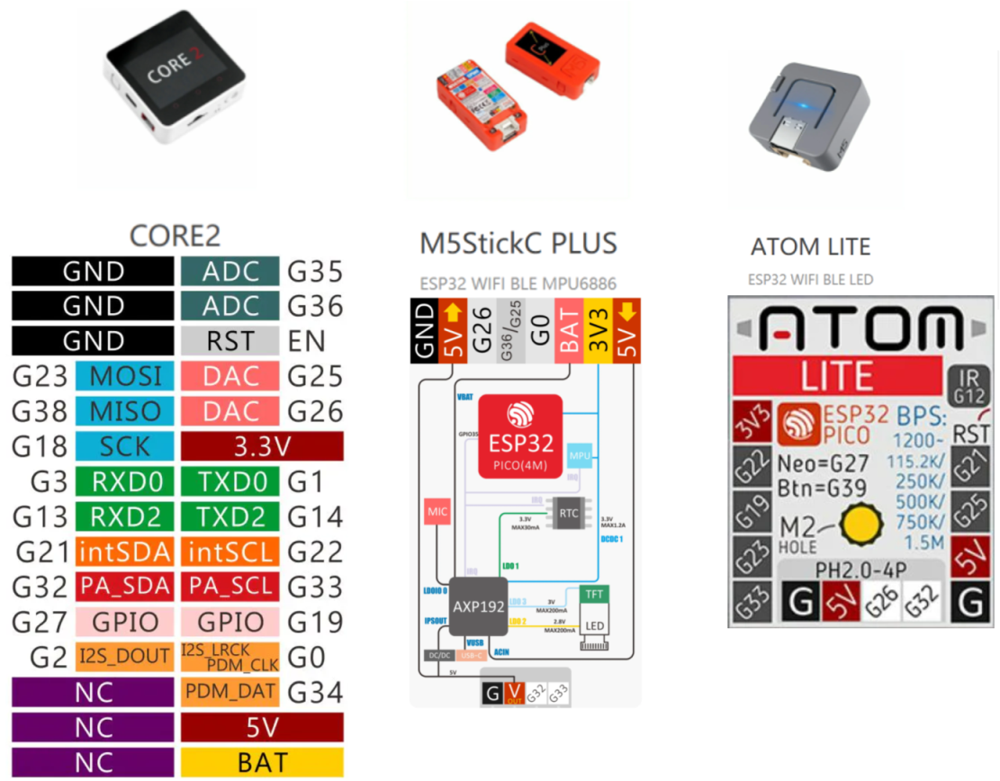

GPIO
----
***

> [⇧ **Home**](../README.md)

- - -

Allzweckeingabe/-ausgabe (engl. GPIO - General Purpose Input/Output) ist ein allgemeiner Kontaktstift (Pin) an einem Mikrocontroller, dessen Verhalten, unabhängig, ob als Eingabe- oder Ausgabekontakt, durch logische Programmierung frei bestimmbar ist. GPIO-Kontakten ist kein Zweck vorgegeben, sie sind daher standardmäßig unbelegt.

Neben den [Ports](../hw#port), verfügt jeder Controller noch über einen weiteren Erweiterungssteckplatz.

Dort können, je nach Controller, weitere 
* [Modules](../hw#modules)
* [Unit(s)](../hw#units)
* [HAT (Hardware Attached on Top)](../hw#hats) 
angeschlossen werden.

Mittels Dupont Kabel und [Protoboard](https://shop.m5stack.com/collections/m5-modules/products/plc-proto-industrial-board-module)(auch Steckplatine, "Steckbrett", "Steckboard") können weitere Sensoren oder Aktoren angeschlossen werden.

