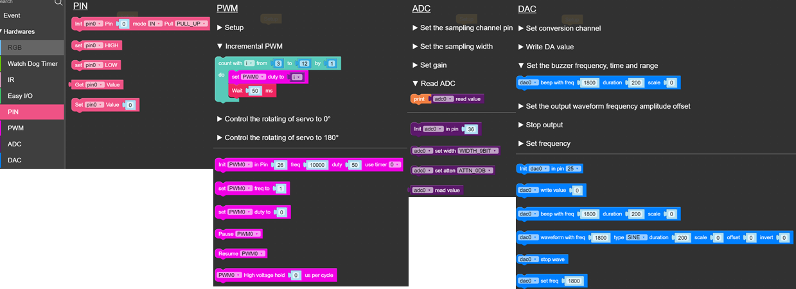

GPIO
----
***

> [⇧ **Home**](../README.md)

- - -

Allzweckeingabe/-ausgabe (engl. GPIO - General Purpose Input/Output) ist ein allgemeiner Kontaktstift (Pin) an einem Mikrocontroller, dessen Verhalten, unabhängig, ob als Eingabe- oder Ausgabekontakt, durch logische Programmierung frei bestimmbar ist. GPIO-Kontakten ist kein Zweck vorgegeben, sie sind daher standardmäßig unbelegt.

Neben den [Ports](../hw#port), verfügt jeder Controller noch über einen weiteren Erweiterungssteckplatz.

Dort können, je nach Controller, weitere 
* [Modules](../hw#modules)
* [Unit(s)](../hw#units)
* [HAT (Hardware Attached on Top)](../hw#hats) 
angeschlossen werden.

Mittels Dupont Kabel und [Protoboard](https://shop.m5stack.com/collections/m5-modules/products/plc-proto-industrial-board-module)(auch Steckplatine, "Steckbrett", "Steckboard") können weitere Sensoren oder Aktoren angeschlossen werden.

### Einleitung
***

- - -

Die Controller verfügen u.a. über die obigen Funktionen um GPIO direkt anzusteuern.

Stattdessen sollten aber besser die Funktionen der [Units](../hw#units) etc. verwendet werden. 

### Pin 

-> Hardware -> [Pin](https://docs.m5stack.com/en/uiflow/advanced/pin) In/Out um den digitalen Wert eines Pins Ein/Aus zu setzen. 

Oder einen digitalen Wert (0 oder 1) eines Pins abzufragen.

**Anwendungen Output** 

*   Ansteuerung von LEDs, z.B. für Taschenlampe, [Kultpfunzel](http://kultpfunzel.ch/) , [Fernsehsimulator,](http://www.pearl.ch/ch-a-NC5312-3110.shtml) [Kleidung](http://www.get-a-led.de/led-t-shirts/led-kleidung-stereo-mc/), Statusanzeigen etc.
*   2 DigitalOut für die Richtungsbestimmung bei Motoren
*   4 DigitalOut für die Ansteuerung von Schrittmotoren

**Anwendungen Input** 

*   Externer Feedback, z.B. Taster.
*   Sensoren welche bei Eintreten eines Ereignisses zwischen 0 und 1 umschalten, z.B. Bewegungsmelder

### PWM

-> Hardware -> [PWM](https://docs.m5stack.com/en/uiflow/advanced/pwm). 

[Pulsweitenmodulation](http://de.wikipedia.org/wiki/Pulsweitenmodulation) (kurz PWM), ist eine Modulationsart, bei der die elektrische Spannung zwischen Ground (0 Volt) und 3.3 Volt wechselt.

Die relative Länge des Pulses wird Tastgrad (englisch duty cycle) genannt.

Der Abstand zwischen dem Startpunkt zwei aufeinanderfolgender Pulse wird "Periode" genannt.

**Anwendungen** 

*   Licht dimmen
*   Motoren Geschwindigkeit regeln
*   Töne erzeugen

### ADC

-> Hardware -> [ADC](https://docs.m5stack.com/en/uiflow/advanced/adc_dac)

Ein Analogsignal ist ein Signals mit stufenlosem und unterbrechungsfreiem Verlauf

In der Elektronik erfolgt die Umsetzung eines elektrischen Analogsignals in ein nutzbares Digitalsignal mittels Analog-Digital-Umsetzern (ADU), die umgekehrte Richtung erfolgt mittels Digital-Analog-Umsetzern (DAU).

**Anwendungen**

*   Auslesen eines Sensorwertes, z.B. Lichtintensität
*   Zusammen mit einen [Potentiometer](http://de.wikipedia.org/wiki/Potentiometer) um einen Schwellenwert für ein Ereignis, z.B. für das Anschalten des Lichtes, oder um die Geschwindigkeit für einen Motor einzustellen.

### DAC

-> Hardware -> [DAC](https://docs.m5stack.com/en/uiflow/advanced/adc_dac)

Ein Digital-Analog-Umsetzer (DAU, englisch digital-to-analog converter (DAC)), auch Digital-Analog-Wandler oder D/A-Wandler genannt,[1] wird verwendet, um digitale Signale oder einzelne Werte in analoge Signale umzusetzen. 

