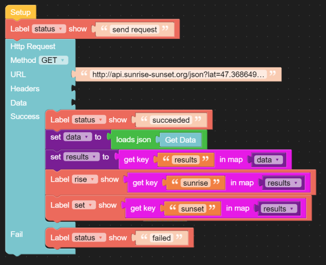
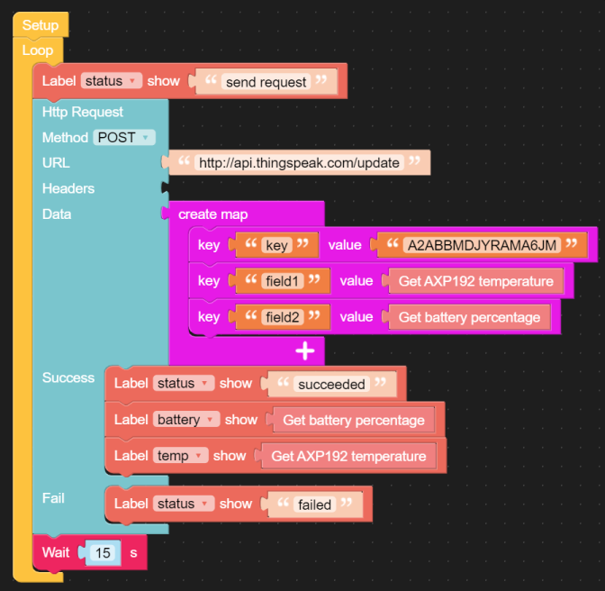

## Einleitung HTTP (Hypertext Transfer Protocol)
***

> [⇧ **Home**](../README.md)

**Anfrage:**

```js
								
GET /infotext.html HTTP/1.1
Host: www.example.net
```

- - -

**Antwort:**

```js
HTTP/1.1 200 OK
Server: Apache/1.3.29 (Unix) PHP/4.3.4
Content-Length: 123456 (Größe von infotext.html in Byte)
Content-Language: de (nach RFC 3282 sowie RFC 1766)
Connection: close
Content-Type: text/html

Nachrichtenrumpf
```
- - -

Das Hypertext Transfer Protocol (HTTP, englisch für Hypertext-Übertragungsprotokoll) ist ein **Protokoll zur Übertragung von Nachrichten und Daten**. Es wird hauptsächlich eingesetzt, um Webseiten (Hypertext-Dokumente) aus dem World Wide Web (WWW) in einen Webbrowser zu laden. Es ist jedoch nicht prinzipiell darauf beschränkt und auch als allgemeines Dateiübertragungsprotokoll sehr verbreitet.

Jede Nachricht besteht dabei aus zwei Teilen, dem [Nachrichtenkopf (englisch Message Header, kurz: Header oder auch HTTP-Header genannt)](http://de.wikipedia.org/wiki/Liste_der_HTTP-Headerfelder) und dem Nachrichtenrumpf (englisch Message Body, kurz: Body). Der Nachrichtenkopf enthält die **Anfragemethode** und Informationen über den Nachrichtenrumpf wie etwa verwendete Kodierungen oder den Inhaltstyp. Der Nachrichtenrumpf enthält die Nutzdaten (siehe HTML unten).

Von den Nachrichten gibt es zwei unterschiedliche Arten: die Anfrage (englisch Request) vom **Client an den Server** und die Antwort (englisch Response) als Reaktion darauf vom **Server zum Client**. 

#### HTTP-Anfragemethoden (nicht abschliessend)

*   **GET**: ist die gebräuchlichste Methode. Mit ihr wird eine Ressource (zum Beispiel eine HTML Datei) vom Server angefordert.
*   **POST**: schickt Daten zur weiteren Verarbeitung zum Server.
*   **PUT**: dient dazu eine Ressource (zum Beispiel eine Datei) auf einen Webserver hochzuladen.
*   **DELETE**: löscht die angegebene Ressource auf dem Server.

Heute ist **PUT**, ebenso wie **DELETE**, kaum implementiert. Beides erlangt jedoch mit dem [REST Programmierparadigma](http://de.wikipedia.org/wiki/Representational_State_Transfer) neue Bedeutung.

### Anwendungen 

*   Holen, Schreiben und Löschen von Daten und Dateien auf HTTP Servern.

### HTML (Nachrichtenrumpf) 

Die Hypertext Markup Language (engl. für Hypertext-Auszeichnungssprache), abgekürzt HTML, ist eine textbasierte [maschinenlesbare Sprache (markup language)](http://de.wikipedia.org/wiki/Auszeichnungssprache) zur Strukturierung digitaler Dokumente wie Texte mit Hyperlinks, Bildern und anderen Inhalten.

HTML-Dokumente sind die Grundlage des World Wide Web und werden von Webbrowsern dargestellt.

## (HTTP) Cloud Services


- - -

In der Cloud stehen einen Reihe von Services zur Verfügung womit die Boards mit Steuerungsinformationen, wie Sonnen Auf- und Untergang, Wetterentwicklung etc. versorgt werden können.

[ProgrammableWeb](http://www.programmableweb.com/apis/directory) und [Public APIs](https://github.com/public-apis/public-apis) liefert eine Übersicht dieser Dienste.

**Anwendungen** 

*   Intelligente Dämmerungsschaltung mit Berücksichtigung Sonnen Auf- und Untergang
*   Intelligente, Vorausschauende Heizung, z.B. Heizung nicht aktivieren, wenn Sonnenschein angekündigt ist
*   Vorbeugung von Unwetterschäden, z.B. durch Einfahren der Sonnenstoren bei aufkommenden Sturm

### Beispiele

* [Sunrise Sunset](#sunset-sunrise-json) - HTTP GET
* [JSON](#json-javascript-object-notation)
* [ThinkSpeak](#thingspeak) - HTTP POST

Weitere Beispiele, inkl. HTTPS, findet man auf [http://os.mbed.com/teams/sandbox/code/http-example/](http://os.mbed.com/teams/sandbox/code/http-example/).


### Sunset Sunrise (JSON)
***

> [⇧ **Nach oben**](#beispiele)


- - -

Sunrise Sunset stellt ein API zur Verfügung, mittels dem die Sonnen Auf- und Untergangszeiten für einen bestimmten Ort abgefragt werden können.

**Links**

*   [Website](http://sunrise-sunset.org/)
*   [API Beschreibung](http://sunrise-sunset.org/api)
*   [Sonnen Auf- und Untergang für Zürich](http://sunrise-sunset.org/search?location=Z%C3%BCrich%2C+Schweiz)

**Beispiel: Abfrage für Zürich** 

[http://api.sunrise-sunset.org/json?lat=47.3686498&amp;lng=8.5391825](http://api.sunrise-sunset.org/json?lat=47.3686498&lng=8.5391825)

```js
{"results":
   { "sunrise":"5:38:12 AM",
     "sunset":"5:31:12 PM",
     "solar_noon":"11:34:42 AM",
     "day_length":"11:53:00",
     "civil_twilight_begin":"5:07:47 AM",
     "civil_twilight_end":"6:01:38 PM",
     "nautical_twilight_begin":"4:32:04 AM",
     "nautical_twilight_end":"6:37:21 PM",
     "astronomical_twilight_begin":"3:55:32 AM",
     "astronomical_twilight_end":"7:13:52 PM"
   },
   "status":"OK"}
```

**Beispiel mit Core2** - [sunrise-sunset.m5f](sunrise-sunset.m5f)



- - -

    from m5stack import *
    from m5stack_ui import *
    from uiflow import *
    import urequests
    import json
    
    
    screen = M5Screen()
    screen.clean_screen()
    screen.set_screen_bg_color(0xFFFFFF)
    
    data = None
    results = None
    
    label0 = M5Label('Aufgang', x=45, y=31, color=0x000, font=FONT_MONT_14, parent=None)
    label1 = M5Label('Untergang', x=45, y=64, color=0x000, font=FONT_MONT_14, parent=None)
    status = M5Label('Status', x=45, y=120, color=0x000, font=FONT_MONT_14, parent=None)
    rise = M5Label('sunrise', x=176, y=33, color=0x000, font=FONT_MONT_14, parent=None)
    set = M5Label('sunset', x=176, y=67, color=0x000, font=FONT_MONT_14, parent=None)
    
    status.set_text('send request')
    try:
      req = urequests.request(method='GET', url='http://api.sunrise-sunset.org/json?lat=47.3686498&lng=8.5391825')
      status.set_text('succeeded')
      data = json.loads((req.text))
      results = data['results']
      rise.set_text(str(results['sunrise']))
      set.set_text(str(results['sunset']))
    except:
      status.set_text('failed')


### JSON (JavaScript Object Notation)
***

> [⇧ **Nach oben**](#beispiele)

Das Sunrise Sunset Beispiel verwendet, als Datenformat, die [JavaScript Object Notation, kurz JSON](http://de.wikipedia.org/wiki/JavaScript_Object_Notation).

Die [JavaScript Object Notation, kurz JSON](http://de.wikipedia.org/wiki/JavaScript_Object_Notation), ist ein kompaktes Datenformat in einer einfach lesbaren Textform zum Zweck des Datenaustauschs zwischen Anwendungen. Jedes gültige JSON-Dokument soll ein gültiges JavaScript sein und per eval() interpretiert werden können. JSON ist unabhängig von der Programmiersprache. Parser existieren in praktisch allen verbreiteten Sprachen.

## ThingSpeak
***

> [⇧ **Nach oben**](#beispiele)


- - -

ThingSpeak ist eine "Internet der Dinge" Anwendung um Daten zu sammeln, analysieren und mittels Triggern darauf zu reagieren.

Um ThingSpeak verwenden zu könnnen ist zuerst ein Login [SigUp](https://thingspeak.com/) zu lösen und anschliessend ein neuer Channel mit folgenden Feldern einzurichten:

*   Field 1: Temp
*   Field 2: Hum

Auf den **Data Import / Export** Tab zu wechseln und die Variablen _host_ und _key_ entsprechend den **Update Channel Feed - POST (rechts)** Angaben anzupassen.

Programm compilieren und auf das Board downloaden. Unter **Private View** sollten zwei Grafiken mit den aktuellen Sensorwerten sichtbar werden.

**Links**

*   [ThingSpeak Channel aus Beispiel](https://thingspeak.com/channels/82291) 
*   [Website](https://thingspeak.com/)
*   [Einführung in ThingSpeak](http://www.codeproject.com/Articles/845538/An-Introduction-to-ThingSpeak)
*   [ThingSpeak im Praxistest](http://blog.zuehlke.com/die-iot-plattform-thingspeak-im-praxistest/)

**Beispiel mit Core2** - [thingspeak.m5f](thingspeak.m5f)



- - -

    from m5stack import *
    from m5stack_ui import *
    from uiflow import *
    import urequests
    import time
    from easyIO import *
    
    screen = M5Screen()
    screen.clean_screen()
    screen.set_screen_bg_color(0xFFFFFF)
    
    label0 = M5Label('Temperatur', x=45, y=31, color=0x000, font=FONT_MONT_14, parent=None)
    label1 = M5Label('Batterie %', x=45, y=64, color=0x000, font=FONT_MONT_14, parent=None)
    status = M5Label('Status', x=45, y=120, color=0x000, font=FONT_MONT_14, parent=None)
    temp = M5Label('temp', x=176, y=33, color=0x000, font=FONT_MONT_14, parent=None)
    battery = M5Label('battery', x=176, y=67, color=0x000, font=FONT_MONT_14, parent=None)
    
    while True:
      status.set_text('send request')
      try:
        req = urequests.request(method='POST', url='http://api.thingspeak.com/update',json={'key':'A2ABBMDJYRAMA6JM','field1':(power.getTempInAXP192()),'field2':(map_value((power.getBatVoltage()), 3.7, 4.1, 0, 100))})
        status.set_text('succeeded')
        battery.set_text(str(map_value((power.getBatVoltage()), 3.7, 4.1, 0, 100)))
        temp.set_text(str(power.getTempInAXP192()))
      except:
        status.set_text('failed')
      wait(15)
      wait_ms(2)


Das Beispiel ThingSpeak schickt, mittels HTTP POST, Sensordaten an den ThingSpeak Cloud Dienst. Die Daten sind dann auf folgendem [ThingSpeak Channel](https://thingspeak.com/channels/82291) ersichtlich.

