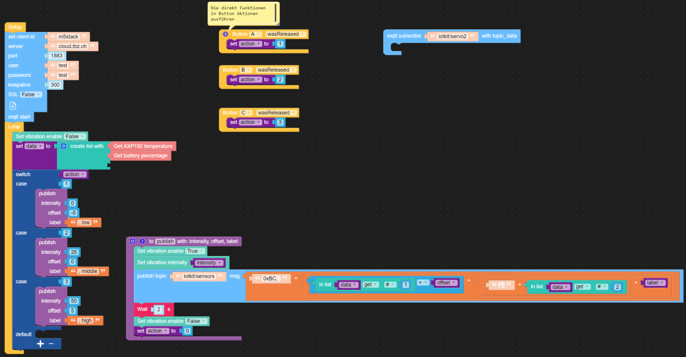

Internet of Things – Machine Learning Fast Data Pipeline mit Docker/Kubernetes
==============================================================================

> [⇧ **Home**](https://github.com/iotkitv3/intro)

- - - 

Bei dieser Fast Data Pipeline werden
* Sensordaten (Temperatur) von einen IoT Gerät erhoben und
* weitergerreicht (Publish) an einem [Raspberry Pi](https://www.raspberrypi.org/) (Edge) mit MQTT Broker
* der Low-Code Service [Node-RED](https://nodered.org/) holt diese Daten (Subscribe) 
    * wandelt diese nach HTTP (REST) für die [Prozess Workflow Engine](https://camunda.com/) (BPMN) und
    * reicht sie an ein Hochverfügbares Messaging System ([Kafka](https://kafka.apache.org/)) weiter für Verarbeitungen wie Maschine Learning.
    
Dabei kommen folgende Technologien/Produkte zum Einsatz:
* **Iot**: M5Stack Core2 - [Beispiel](pipeline-lite.m5f) 
* **Cloud**: [lernMAAS](https://github.com/mc-b/lernmaas) oder eine lokale Umgebung z.B. die vom [ModTec Kurs](https://github.com/mc-b/modtec)
    * [Kubernetes](https://kubernetes.io/de/) als Container Umgebung
    * [Node-RED](https://nodered.org/) (Triage und Protokollwandler)
    * Hochverfügbarkeits Messaging mittels [Kafka](https://kafka.apache.org/)
    * die [Camunda Prozess (BPMN) Engine](https://camunda.com/) für Geschäftsprozesse Workflows
    * [Juypter Notebook](https://jupyter.org/) für die Verarbeitung der Daten mittels Machine Learning.    
    
Auf den Raspberry Pi (Edge) wird verzichtet, weil dort die gleiche Umgebung wie in der Cloud läuft (Linux/Kubernetes).

***    
Installation und Konfiguration
------------------------------

### Internet of Things (M5Stack Core2)

- - - 

In der einfachsten Variante, werden mit dem obigen [Beispiel](pipeline-lite.m5f) die Temperatur der MCU und die Batterieladung in % übermittelt.

Je nach vorhandenen Sensoren (z.B. Unit Env III) und Aktoren (z.B. Servo) kann das Programm auch erweitert werden.

***
### Cloud Umgebung

**Variante a) lernMAAS mit ModTec Umgebung**

In einer [lernMAAS](https://github.com/mc-b/lernmaas) Umgebung ist eine VM mit Namen `modtec-XX` (XX = Hostanteil für VPN) zu erstellen und auf dem lokalen Notebook kann die 
Umgebung vom [ModTec Kurs](https://github.com/mc-b/modtec) verwendet werden. 

Bei beiden Umgebungen sind alle benötigten Services wie Camunda, Node-RED, Kafka etc. bereits gestartet.

Evtl. muss der BPMN Prozess noch veröffentlicht werden.

**Variante b) Cloud und Cloud-init**

Erstellen Sie einen Account für die [AWS](https://aws.amazon.com/de/free/) oder [Azure](https://azure.microsoft.com/de-de/overview/what-is-azure/iaas/) Cloud.

Erstellen Sie eine neue Virtuelle Maschine mit min. 2 CPUs, 4 GB RAM. Als Betriebsystem nehmen Sie Ubuntu ab der Version 20.04. 

Im Feld `custom data` o.ä. füllen Sie folgende [Cloud-init](https://cloudinit.readthedocs.io/en/latest/) Konfiguration ein:

    #cloud-config
    users:
      - name: ubuntu
        sudo: ALL=(ALL) NOPASSWD:ALL
        groups: users, admin
        home: /home/ubuntu
        shell: /bin/bash
        lock_passwd: false
        plain_text_passwd: 'password'        
    # login ssh and console with password
    ssh_pwauth: true
    disable_root: false    
    packages:
      - unzip
    runcmd:
      - sudo snap install microk8s --classic
      - sudo usermod -a -G microk8s ubuntu
      - sudo microk8s enable dns ingress
      - sudo mkdir -p /home/ubuntu/.kube
      - sudo microk8s config >/home/ubuntu/.kube/config
      - sudo chown -f -R ubuntu /home/ubuntu/.kube
      - sudo snap install kubectl --classic
      - sudo mkdir /data
      - sudo microk8s kubectl apply -f https://raw.githubusercontent.com/mc-b/lernkube/master/data/DataVolume.yaml
      - sudo microk8s kubectl apply -f https://raw.githubusercontent.com/mc-b/duk/master/addons/dashboard-skip-login-no-ingress.yaml
      - (cd /tmp; git clone https://github.com/mc-b/mlg; cd mlg; microk8s kubectl apply -f jupyter/jupyter-mlg.yaml; cp -rpv data/* /data/ )
      - sudo microk8s kubectl apply -f https://raw.githubusercontent.com/mc-b/duk/master/iot/mosquitto.yaml
      - sudo microk8s kubectl apply -f https://raw.githubusercontent.com/mc-b/duk/master/kafka/zookeeper.yaml
      - sudo microk8s kubectl apply -f https://raw.githubusercontent.com/mc-b/duk/master/kafka/kafka.yaml
      - sudo microk8s kubectl apply -f https://raw.githubusercontent.com/mc-b/iot.kafka/master/iot-kafka-alert.yaml
      - sudo microk8s kubectl apply -f https://raw.githubusercontent.com/mc-b/iot.kafka/master/iot-kafka-consumer.yaml
      - sudo microk8s kubectl apply -f https://raw.githubusercontent.com/mc-b/iot.kafka/master/iot-kafka-pipe.yaml
      - sudo microk8s kubectl apply -f https://raw.githubusercontent.com/mc-b/duk/master/iot/nodered-kafka.yaml
      - sudo microk8s kubectl apply -f https://raw.githubusercontent.com/mc-b/misegr/master/bpmn/camunda.yaml
      - sudo apt-get update  
      - sudo apt-get install -y mosquitto-clients curl git unzip
      - sudo chmod -R o=u,g=u /data  
      - sudo chmod 777 /data 

Nach erfolgreicher Installation sind folgende Services verfügbar:
* [Camunda BPMN Workflow Engine](https://camunda.com/) auf http://[ip vm]:30880/camunda/
* [mosquitto](https://projects.eclipse.org/projects/iot.mosquitto) auf Port 31883 (nur MQTT Broker ohne UI)
* [Node-RED](https://nodered.org/) auf http://[ip vm]:32600
* [Jupyter mit Machine Learning Notebooks](https://jupyter.org/) auf http://[ip vm]:32088
* [Kubernetes Dashboard](https://kubernetes.io/docs/tasks/access-application-cluster/web-ui-dashboard/) auf https://[ip vm]

**ACHTUNG**: das ist eine Lernumgebung, werden die Ports gegen das gesamte Internet geöffnet ist die VM ungeschützt im Internet. Ports nur für eigene IP-Adresse (Router) öffnen.

**Hinweis**: Statt die VM über das Cloud UI zu Erstellen, kann auch das CLI der Cloud Anbieter verwendet werden. Dazu erstellt man eine Datei `cloud-init.cfg` und fügt obigen Inhalt in die Datei. Die weiteren Befehle stehen [hier](https://github.com/mc-b/iac/blob/main/cloud-iac-cli.md).

**Veröffentlichung des BPMN Prozesses**

Die Pipeline braucht einen vorbereitenden [BPMN Prozess](https://github.com/mc-b/bpmn-tutorial#schritt-2---prozess-ver%C3%B6ffentlichen-und-ausf%C3%BChren). Diesen können Sie über das Juypter Notebook http://[ip vm]:32088/notebooks/Microservices-BPMN-microk8s.ipynb veröffentlichen.

***
### Node-RED (MQTT - Kafka Messaging)

- - -

Die MQTT Messages sollen nun an [Apache Kafka](https://kafka.apache.org/) weitergeleitet werden. Das hat den Vorteil, dass wir diese
* in andere Formate, z.B. von Binär nach JSON, umwandeln können
* sie Persistieren können
* ein Eventlog erhalten
* etc.

Um [Apache Kafka](https://kafka.apache.org/) anzusprechen brauchen wir ein paar zusätzliche Plugins.

Diese können in Node-RED mittels Pulldownmenu rechts -> `Palette verwalten`, Tab `Installieren` hinzugefügt werden. Es handelt es sich um die Plugins:
* node-red-contrib-kafka-node-latest - mindestens Version 0.2
* node-red-contrib-kafka-manager - letzte Version

Dadurch erhalten wird neu `Nodes` für die Integration mit [Apache Kafka](https://kafka.apache.org/).    

* In Node-RED
    * `mqtt` Input Node auf Flow 1 platzieren, mit Mosquitto Server verbinden, als Topic `iotkit/#` und bei Output `a String` eintragen.
    * `debug` Output Node auf Flow 1 platzieren und mit Input Node verbinden - damit können wir die MQTT Messages kontrollieren
    * `change` Node auf Flow 1 platzieren und als Regel `Ändern` Wert `msg.topic` von `iotkit/alert` in `broker_message`, weitere Regel hinzufügen und gleich verfahren für `iotkit/sensor` nach `broker_message`.
    * Kafka Producer auf Flow 1 platzieren und mit Kafka Server (kafka:9092) verbinden
    * Alle Nodes wie oben in der Grafik verbinden und veröffentlichen (deploy).
* Kubernetes    
    * Neben Kafka wurden drei Microservices, `iot-kafka-alert` (Weiterleitung iotkit/alert Topic an Camunda), `iot-kafka-consumer` (Schreiben der Sensordaten nach /data/ml-data.csv) und `iot-kafka-pipe` (Umwandeln der Sensordaten ins JSON Format), gestartet.
    * Das Ergebnis kann mittels `kubectl logs deployment/iot-....` angeschaut werden. 

<pre>
    kubectl logs deployment/iot-kafka-alert
    kubectl logs deployment/iot-kafka-consumer
    kubectl logs deployment/iot-kafka-pipe
</pre>

* In Camunda BPMN Workflow Engine [https://localhost:30443/camunda](https://localhost:30443/camunda) (URL kann abweichen, je nach Umgebung) einloggen mittels User/Password `demo/demo`. Bei jedem Alarm welcher vom Board (Hall Sensor) mittels Magneten ausgelöst wird, sollte ein neuer Rechnungsprozess gestartet werden.
    

Topics auslesen, lesen und schreiben auf Topics in Kafka Container, siehe [Projekt duk](https://github.com/mc-b/duk/tree/master/kafka).

Der Flow zum importieren und anpassen, siehe [Node-RED-Kafka.json](Node-RED-Kafka.json).

***
### Machine Learning mit Juypter Notebooks

Ein [Jupyter Notebook](https://jupyter.org/) ist eine Open-Source-Webanwendung, mit der Sie wiederholende Abläufe erstellen können. Die Live-Code, Gleichungen, Visualisierungen und Text enthalten können.

Verwendungsmöglichkeiten:
* Datenbereinigung und -transformation
* numerische Simulation
* statistische Modellierung
* Datenvisualisierung
* maschinelles Lernen und vieles mehr.

Jupyter Notebooks laufen lokal, ein einem Container oder in der Cloud.

**Maschinelles Lernen** ist ein Oberbegriff für die «künstliche» Generierung von Wissen aus Erfahrung. Ein künstliches System lernt aus Beispielen und kann diese nach Beendigung der Lernphase verallgemeinern. Das heisst, es werden nicht einfach die Beispiele auswendig gelernt, sondern es «erkennt» Muster und Gesetzmässigkeiten in den Lerndaten. 

Das Juypter Notebook [MLTempHumSensor](https://github.com/mc-b/mlg/blob/master/data/mlg/02-2-MLTempHumSensor.ipynb) demonstriert [Predictive Maintenance](https://de.wikipedia.org/wiki/Pr%C3%A4diktive_Instandhaltung) anhand von Demodaten.

Sollen die Live Daten des IoTKitV3 ausgewertet werden, ist der Code unter "Gegenprüfung mit Testdaten" wie folgt zu ändern:

    test = pd.read_csv('ml-data.csv', header=None, names=['sensor', 'temp', 'hum', 'class'] )
    
Wird das Beispiel jetzt nochmals von vorne durchgespielt (Kernel -> Restart & Run All), erfolgt ein Vergleich mit den Live Daten des M5Stack Core2.    

