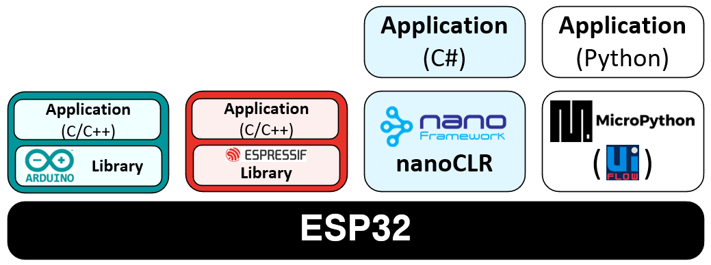
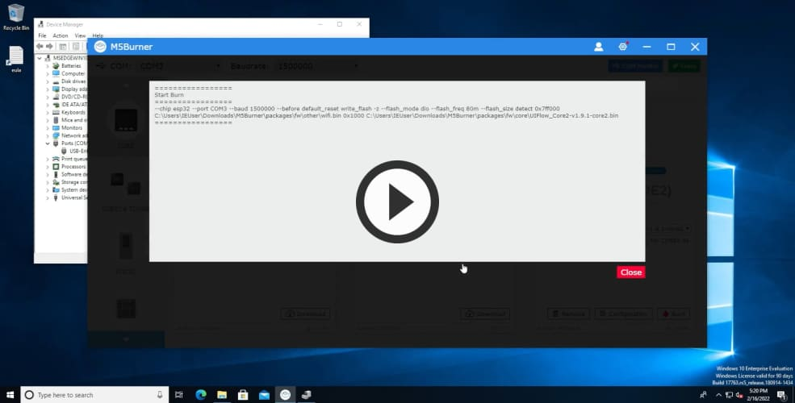
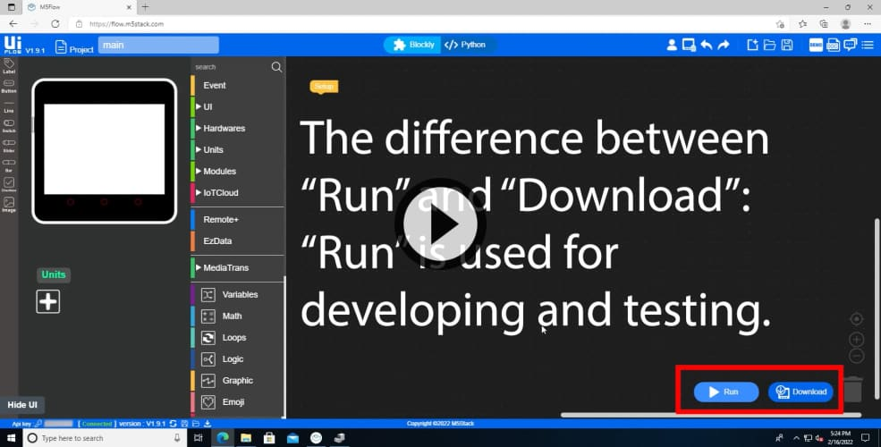
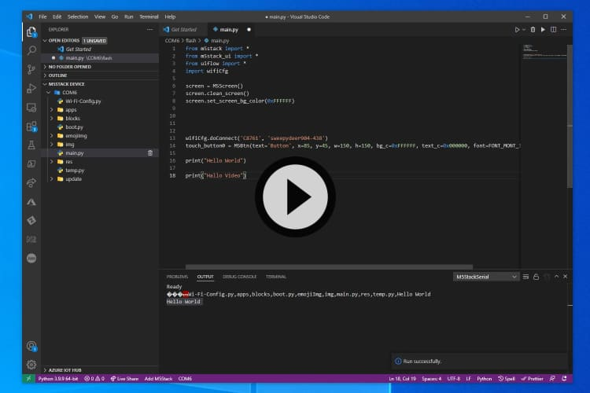

# Software
***

> [⇧ **Home**](../README.md)


## Inhaltsverzeichnis

- [Software](#software)
  - [Inhaltsverzeichnis](#inhaltsverzeichnis)
  - [Einleitung](#einleitung)
  - [Hardware Driver](#hardware-driver)
  - [Burning Tool](#burning-tool)
    - [Konfiguration / Start Mode](#konfiguration--start-mode)
    - [Videoanleitung - Installation M5Burner and Core2 UiFlow firmware flash](#videoanleitung---installation-m5burner-and-core2-uiflow-firmware-flash)
    - [Videoanleitung - Umschaltung zwischen dem Internet Mode und App Mode - Developing / Deployment](#videoanleitung---umschaltung-zwischen-dem-internet-mode-und-app-mode---developing--deployment)
  - [UIFlow](#uiflow)
  - [Visual Studio Code (UIFlow Micropython)](#visual-studio-code-uiflow-micropython)
    - [Fork - alptbz](#fork---alptbz)
    - [Videoanleitung UiFlow Micropython with Visual Studio Code](#videoanleitung-uiflow-micropython-with-visual-studio-code)
  - [esptool.py](#esptoolpy)
    - [Firmware löschen](#firmware-löschen)
  - [Ampy](#ampy)
  - [PlatfromIO](#platfromio)

## Einleitung
***



Die M5Stack Controller können auf unterschiedliche Arten programmiert werden: 

| Programmiersprache | Library/Framework/Runtime | Tools                             |
|--------------------|---------------------------|-----------------------------------|
| C/C++              | [Arduino Library](https://www.arduino.cc/reference/en/libraries/)           | Arduino IDE, [Platformio](https://docs.platformio.org/en/stable/boards/espressif32/m5stack-core2.html)           |
| C/C++              | [Espressif Framework](https://docs.platformio.org/en/stable/frameworks/espidf.html#framework-espidf)       | [Platformio](https://docs.platformio.org/en/stable/boards/espressif32/m5stack-core2.html)                        |
| Python             | [MicroPython](https://micropython.org/)               | [Visual Studio Code](https://marketplace.visualstudio.com/items?itemName=curdeveryday.vscode-m5stack-mpy) / [flow.m5stack](https://flow.m5stack.com/) |
| C#                 | [.NET nanoframework](https://www.nanoframework.net/)        | [Visual Studio](https://marketplace.visualstudio.com/items?itemName=nanoframework.nanoFramework-VS2019-Extension)                     |


Bei der Entwicklung mit dem *.NET nanoframework* oder *MicroPython* erfolgt die Ausführung der Applikation mithilfe einer Runtime, die zuvor auf den ESP geflasht wird. Das bringt Vorteile, wie einfacheres Debugging und die Möglichkeit [Höhere Programmiersprachen](https://de.wikipedia.org/wiki/H%C3%B6here_Programmiersprache) wie Python oder C# einzusetzen. Zudem muss sich der Entwickler nicht um komplexes Speichermanagement kümmern. Der Nachteil zeigt sich in einer schlechteren Performance. Zudem ist es meistens notwendig, dass Sensoren, Bus-Protokolle (I2C) in der Runtime implementiert sind, da die Implementation von Geräten in den höheren Programmiersprachen meistens schlechte Performance bringt. Weiter benötigt das flashen von [*Bare Metal Programmen*](https://en.wikipedia.org/wiki/Bare_machine) meistens viel Länger. 

Um die [*Low -level Programmierung*](https://en.wikipedia.org/wiki/Low-level_programming_language) kommt man bei komplexeren Projekten früher oder später nicht herum. 

Um die Welt von Mikroprozessoren und IoT Geräten besser kennenzulernen und den Einstieg zu erleichtern, empfiehlt es sich mit Höheren Programmiersprachen zu arbeiten, da C/C++ einige Hürden mit sich bringt. 

* [UIFlow](https://docs.m5stack.com/en/quick_start/core2/m5stack_core2_get_started_MicroPython) - empfohlen
* [.NET nanoframework](https://github.com/nanoframework/nanoFramework.M5Stack) - empfohlen
* [Visual Studio Code mit Micropython](https://marketplace.visualstudio.com/items?itemName=curdeveryday.vscode-m5stack-mpy)
* [Arduino IDE](https://docs.m5stack.com/en/arduino/arduino_core2_development)

Dazu ist, zuerst der richtige Hardware Driver zu installieren und anschliessend ein Firmware Update durchzuführen. 

Die Videoanleitung weiter unten zeigt, wie man die UIFlow auf den M5stack flasht. 

Die nötigen Schritte sind im **Quick Start** jedes Controllers beschrieben.

* [M5Stack BASIC](https://docs.m5stack.com/en/quick_start/m5core/m5stack_core_get_started_MicroPython)
* [M5Stack Core2](https://docs.m5stack.com/en/quick_start/core2/m5stack_core2_get_started_MicroPython) - empfohlen.
* [M5StickC Plus](https://docs.m5stack.com/en/quick_start/m5stickc_plus/m5stickc_plus_quick_start_with_uiflow)
* [Atom Lite und Matrix](https://docs.m5stack.com/en/quick_start/atom/atom_quick_start_uiflow)

Die nachfolgenden Anleitungen gehen auf Besonderheiten ein, welche in den **Quick Start** Tutorials fehlen.

## Hardware Driver
***

> [⇧ **Nach oben**](#inhaltsverzeichnis)

Der Hardware Driver stellt einen USB Seriellen Port (Windows COMx, Linux/Mac /dev/ttyUSB) zur Verfügung.

Über diesen wird der Controller programmiert, Firmwware Updates durchgeführt, die Konfigurations (z.B. WLAN) geändert.

* **M5Stack Controller** brauchen den [cp210x driver](https://docs.m5stack.com/en/quick_start/core2/m5stack_core2_get_started_MicroPython).
* **M5Stick** und **Atom** brauchen den [FTDI USB Driver](https://docs.m5stack.com/en/quick_start/atom/atom_quick_start_uiflow). Der von Windows installierte Driver funktioniert nicht sauber.

## Burning Tool
***

> [⇧ **Nach oben**](#inhaltsverzeichnis)


- - -

Dient zum Updaten der Firmware und Einstellen von Konfigurationen wie z.B. WLAN SSID und Password.

* **Configuration** - setzt WLAN SSID, Start Mode etc.
* **Download** oder **Burn** - Downladen und Firmware auf Controller updaten.

**Tip**: beim Updaten der Firmware, WLAN SSID und Password frei lassen. Tests haben ergeben, dass diese Werte mittels **Configuration** sauberer gesetzt werden.

**Dieses Tools sollte immer Installiert werden, um die Controller in den Urzustand zurück setzen zu können.**

### Konfiguration / Start Mode
***

> [⇧ **Nach oben**](#inhaltsverzeichnis)


- - -

Mittels des Burning Tools, erfolgt auch die Konfiguration der Controller.

Den API Keys braucht es für die Programmierung des Controllers via Web.

Die verschiedenen Start Mode haben folgende Bedeutung:
* **Internet Mode** - Programmierung erfolgt mittels Web IDE - [https://flow.m5stack.com](https://flow.m5stack.com)
* **USB Mode** - Programmierung erfolgt via Offline UIFlow IDE
* **APP Mode** - das letzte Programm wird ausgeführt. I.d.R. gespeichert als `main.py`. Eine Programmierung ist diesem Mode nicht möglich.

Die Modi können via Burning Tool oder nach einem `Reset/Power` umgestellt werden. 


Eine Anleitung findet sich am Ende jeden **Quick Start** Tutorials.

Ansonsten sind nur WLAN SSID und Password zu setzen. Die anderen Werte sollten auf den Standardeinstellungen belassen werden.

### Videoanleitung - Installation M5Burner and Core2 UiFlow firmware flash
[](https://raw.githubusercontent.com/alptbz/m242/main/sw/videos/00_M5Burner.webm)


### Videoanleitung - Umschaltung zwischen dem Internet Mode und App Mode - Developing / Deployment
[](https://raw.githubusercontent.com/alptbz/m242/main/sw/videos/01_SwitchAppModeInternetMode.webm)


## UIFlow
***

> [⇧ **Nach oben**](#inhaltsverzeichnis)


- - -

Die UIFlow ist die bevorzugte Entwicklungsumgebung für die Controller.

Vereinfach basiert UIFlow auf [Micropython](https://micropython.org/) und [Blockly](https://developers.google.com/blockly) bzw. vereint diese zu einem Produkt.

Die Programmierung kann Grafisch (empfohlen) oder via [Micropython](https://micropython.org/) erfolgen.

In der Grafischen Ansicht, können neue Sensoren oder Aktoren via `+` Button unter `Units` hinzugefügt werden. Pin Belegungen, werden dann automatisch, je nach Controller, automatisch gesetzt. Unter `Units` werden mögliche Befehle angezeigt.


In der `Python` Ansicht sind evtl. bereits gespeicherte Python Scripts auf dem Controller sichtbar. Auch können neue Scripts angelegt oder bestehende verändert werden.

`main.py` ist I.d.R. das Hauptprogramm, welches im **App Mode** ausgeführt ist.

**Tip**: [Web Version](https://flow.m5stack.com/) von UIFlow verwenden und gleichzeitig **COM Monitor** im [Burning Tool](#burning-tool) öffnen. Im **COM Monitor** werden Debugging und Fehlermeldungen angezeigt.


## Visual Studio Code (UIFlow Micropython)
***
 - Modus: USB-Mode

Mit dem [vscode-m5stack-mpy](https://github.com/curdeveryday/vscode-m5stack-mpy) Plugin kann der M5Stack Core2 bequem mit dem Visual Studio Code programmiert werden.

### Fork - alptbz
**Stand 28.02.2022:** Dem Original Plugin fehlt leider ein Serial Output. Deshalb wird empfohlen, diesen Fork zu verwenden: https://github.com/alptbz/vscode-m5stack-mpy/releases

**Installation:**
 - Ctrl + Shirt + P 
 - `Extensions: Install from VSIX...` wählen
 - Heruntergeladene VSIX Datei auswählen

### Videoanleitung UiFlow Micropython with Visual Studio Code
[](https://raw.githubusercontent.com/alptbz/m242/main/sw/videos/02_VisualStudioCode.webm)

## esptool.py

A Python-based, open-source, platform-independent utility to communicate with the ROM bootloader in Espressif chips.

https://github.com/espressif/esptool

### Firmware löschen

Teilweise spinnt der *M5Stack Core2* und es ist notwendig diesen komplett zurückzusetzen. 

 - Im Verzeichnis von `esptool.exe` PowerShell öffnen
 - Befehl unten eingeben. `COM?` ersetzen mit entsprechenden *serial port*. 
```
.\esptool.exe --port COM? erase_flash
```
 - M5stack Core2 ausstecken und mit dem Ein/Aus Schalter ausschalten.
 - Den M5Stack Core2 wieder einstecken und einschalten. (Der Bildschirm bleibt schwarz)
 - Weitere Schritte abhängig von gewünschter Firmware. 

## Ampy
***

> [⇧ **Nach oben**](#inhaltsverzeichnis)

Das Adafruit MicroPython tool - [ampy](https://github.com/scientifichackers/ampy) ist ein nützliches Werkzeug um Python Dateien von/nach den Controllern zu kopieren.

Die so kopierten Python Dateien, können dann über das **App Menu** gestartet werden. Eine weitere Programmierung ist nicht erforderlich.

Für den Einsatz des Tools ist der Controller in den **App Mode** zu versetzen.

Beispiel kopieren des Hauptprogrammes auf den Controller:

    ampy -p COM4 put main.py
    
Um mehrere Dateien zu kopieren und im **App Menu** verfügbar zu machen, ist 
* ein Verzeichnis `apps` anzulegen   
* alle Python Dateien in dieses Verzeichnis zu kopieren
* der nachfolgende Befehl aufzurufen

    ampy -p COM4 put apps 

**Links**

* [Install ampy](https://learn.adafruit.com/micropython-basics-load-files-and-run-code/install-ampy)

## PlatfromIO

Siehe [PlatformIO Beispiel](platformio.md)