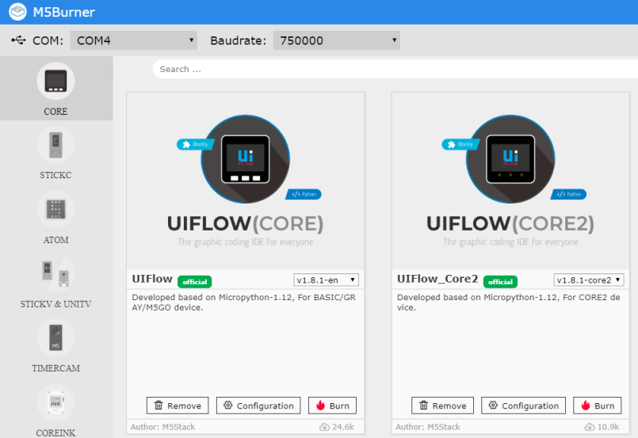
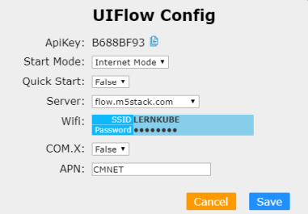
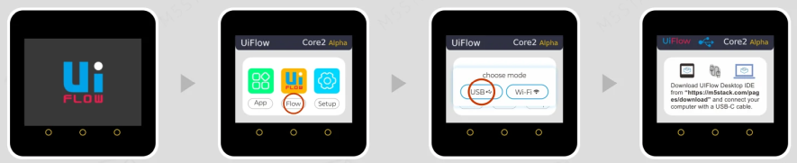
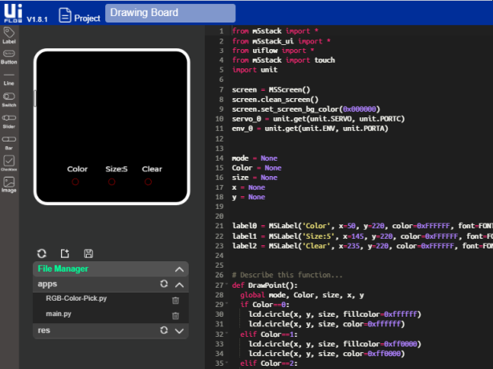

Software
--------
***

> [⇧ **Home**](../README.md)

### Inhaltsverzeichnis

* [Einleitung](#einleitung)
* [Hardware Driver](#hardware-driver)
* [Burning Tool](#burning-tool)
* [Konfiguration / Start Mode](#konfiguration--start-mode)
* [UIFlow IDE](#uiflow)
* [Adafruit MicroPython tool - ampy](#ampy)

### Einleitung
***

Die M5Stack Main Controller können mittels:

* [UIFlow](https://docs.m5stack.com/en/quick_start/core2/m5stack_core2_get_started_MicroPython) - empfohlen
* [Visual Studio Code mit Micropython](https://marketplace.visualstudio.com/items?itemName=curdeveryday.vscode-m5stack-mpy)
* [Arduino IDE](https://docs.m5stack.com/en/arduino/arduino_core2_development)

programmiert werden.

Dazu ist, zuerst der richtige Hardware Driver zu installieren und anschliessend ein Firmware Update durchzuführen. 

Die nötigen Schritte sind im **Quick Start** jedes Controllers beschrieben.

* [M5Stack BASIC](https://docs.m5stack.com/en/quick_start/m5core/m5stack_core_get_started_MicroPython)
* [M5Stack Core2](https://docs.m5stack.com/en/quick_start/core2/m5stack_core2_get_started_MicroPython) - empfohlen.
* [M5StickC Plus](https://docs.m5stack.com/en/quick_start/m5stickc_plus/m5stickc_plus_quick_start_with_uiflow)
* [Atom Lite und Matrix](https://docs.m5stack.com/en/quick_start/atom/atom_quick_start_uiflow)

Die nachfolgenden Anleitungen gehen auf Besonderheiten ein, welche in den **Quick Start** Tutorials fehlen.

### Hardware Driver
***

> [⇧ **Nach oben**](#inhaltsverzeichnis)

Der Hardware Driver stellt einen USB Seriellen Port (Windows COMx, Linux/Mac /dev/ttyUSB) zur Verfügung.

Über diesen wird der Controller programmiert, Firmwware Updates durchgeführt, die Konfigurations (z.B. WLAN) geändert.

* **M5Stack Controller** brauchen den [cp210x driver](https://docs.m5stack.com/en/quick_start/core2/m5stack_core2_get_started_MicroPython).
* **M5Stick** und **Atom** brauchen den [FTDI USB Driver](https://docs.m5stack.com/en/quick_start/atom/atom_quick_start_uiflow). Der von Windows installierte Driver funktioniert nicht sauber.

### Burning Tool
***

> [⇧ **Nach oben**](#inhaltsverzeichnis)

- - -

Dient zum Updaten der Firmware und Einstellen von Konfigurationen wie z.B. WLAN SSID und Password.

* **Configuration** - setzt WLAN SSID, Start Mode etc.
* **Download** oder **Burn** - Downladen und Firmware auf Controller updaten.

**Tip**: beim Updaten der Firmware, WLAN SSID und Password frei lassen. Tests haben ergeben, dass diese Werte mittels **Configuration** sauberer gesetzt werden.

**Dieses Tools sollte immer Installiert werden, um die Controller in den Urzustand zurück setzen zu können.**

### Konfiguration / Start Mode
***

> [⇧ **Nach oben**](#inhaltsverzeichnis)

- - -

Mittels des Burning Tools, erfolgt auch die Konfiguration der Controller.

Den API Keys braucht es für die Programmierung des Controllers via Web.

Die verschiedenen Start Mode haben folgende Bedeutung:
* **Internet Mode** - Programmierung erfolgt mittels Web IDE - [https://flow.m5stack.com](https://flow.m5stack.com)
* **USB Mode** - Programmierung erfolgt via Offline UIFlow IDE
* **APP Mode** - das letzte Programm wird ausgeführt. I.d.R. gespeichert als `main.py`. Eine Programmierung ist diesem Mode nicht möglich.

Die Modi können via Burning Tool oder nach einem `Reset/Power` umgestellt werden. 

Eine Anleitung findet sich am Ende jeden **Quick Start** Tutorials.

Ansonsten sind nur WLAN SSID und Password zu setzen. Die anderen Werte sollten auf den Standardeinstellungen belassen werden.

### UIFlow
***

> [⇧ **Nach oben**](#inhaltsverzeichnis)

- - -

Die UIFlow ist die bevorzugte Entwicklungsumgebung für die Controller.

Vereinfach basiert UIFlow auf [Micropython](https://micropython.org/) und [Blockly](https://developers.google.com/blockly) bzw. vereint diese zu einem Produkt.

Die Programmierung kann Grafisch (empfohlen) oder via [Micropython](https://micropython.org/) erfolgen.

In der Grafischen Ansicht, können neue Sensoren oder Aktoren via `+` Button unter `Units` hinzugefügt werden. Pin Belegungen, werden dann automatisch, je nach Controller, automatisch gesetzt. Unter `Units` werden mögliche Befehle angezeigt.

In der `Python` Ansicht sind evtl. bereits gespeicherte Python Scripts auf dem Controller sichtbar. Auch können neue Scripts angelegt oder bestehende verändert werden.

`main.py` ist I.d.R. das Hauptprogramm, welches im **App Mode** ausgeführt ist.

**Tip**: [Web Version](https://flow.m5stack.com/) von UIFlow verwenden und gleichzeitig **COM Monitor** im [Burning Tool](#burning-tool) öffnen. Im **COM Monitor** werden Debugging und Fehlermeldungen angezeigt.

### Ampy
***

> [⇧ **Nach oben**](#inhaltsverzeichnis)

Das Adafruit MicroPython tool - [ampy](https://github.com/scientifichackers/ampy) ist ein nützliches Werkzeug um Python Dateien von/nach den Controllern zu kopieren.

Die so kopierten Python Dateien, können dann über das **App Menu** gestartet werden. Eine weitere Programmierung ist nicht erforderlich.

Für den Einsatz des Tools ist der Controller in den **App Mode** zu versetzen.

Beispiel kopieren des Hauptprogrammes auf den Controller:

    ampy -p COM4 put main.py
    
Um mehrere Dateien zu kopieren und im **App Menu** verfügbar zu machen, ist 
* ein Verzeichnis `apps` anzulegen   
* alle Python Dateien in dieses Verzeichnis zu kopieren
* der nachfolgende Befehl aufzurufen

    ampy -p COM4 put apps 

**Links**

* [Install ampy](https://learn.adafruit.com/micropython-basics-load-files-and-run-code/install-ampy)

