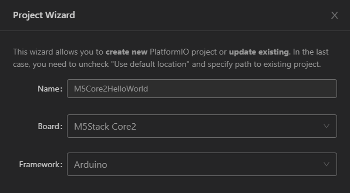
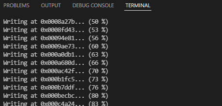

# M5Core2 - PlatformIO

Die einfachste Art den M5Core2 mit C/C++ zu programmieren ist mithilfe von [PlatformIO](https://platformio.org/platformio-ide). Das "Toolset" ist für verschiedene Editoren verfügbar. Empfohlen wird die Verwendung mit [Visual Studio Code](https://code.visualstudio.com/). 

## Installation
Zuerst muss das offizielle *Microsoft Visual Studio Code* installiert werden. Danach wird PlatformIO als Extension direkt in *MS Code* [installiert](https://platformio.org/install/ide?install=vscode). 


---

## Neues Projekt erstellen

Wenn die Home-Seite von PlatformIO nicht automatisch angezeigt wird (Teilweise ist ein Neustart von Visual Studio Code erforderlich). Kann diese über das Launch-Menü `Ctrl+Shirt+P` => `>PlatformIO: Home` aufgerufen werden.


Mit "New Project" wird ein neues Projekt angelegt. Der M5Core2 direkt ausgewählt werden. 



**Tipp:** Wenn das *Protected Folder*-Feature von Windows Security aktiviert ist, empfiehlt es sich nicht den Standard-Pfad zu verwenden, da dieser in *Documents* liegt. 

---

## Beispielprojekt - MQTT + ENV III

Dieses Beispielprojekt liest vom ENV III Unit (Port A) die Temperatur und Luftfeuchtigkeit aus und sendet es an den TBZ MQTT Server. 

 - `platformio.ini` muss zuerst wie folgt angepasst (monitor_port muss individuell angepasst werden) und gespeichert (!) werden:
```
[env:m5stack-core2]
platform = espressif32
board = m5stack-core2
framework = arduino
lib_deps = 
    https://github.com/m5stack/M5Core2
    https://github.com/adafruit/Adafruit_Sensor
    https://github.com/adafruit/Adafruit_BMP280_Library
    https://github.com/m5stack/UNIT_ENV
    https://github.com/knolleary/pubsubclient

build_flags =
    -DBOARD_HAS_PSRAM
    -mfix-esp32-psram-cache-issue

monitor_port = COM6
monitor_speed = 115200
```
 - PlatformIO lädt anschliessend alle Libraries herunter und aktuallisiert IntelliSense (u.a. *Intelligent code completion*).


 - Fügen Sie in `src/main.cpp`den code aus diesem [File](platformio-example/main.cpp) ein. 
 - Für die Internet-Verbindung müssen die WLAN-Zugangsdaten im oberen Teil des Programmes eingetragen werden.
```cpp

float tmp = 0.0;
float hum = 0.0;
float pressure = 0.0;

WiFiClient espClient;
PubSubClient client(espClient);

// Configure the name and password of the connected wifi and your MQTT Serve host. 
...

const char* ssid = "<YOUR WIFI NAME HERE>";
const char* password = "<YOUR WIFI PASSWORD HERE>";
const char* mqtt_server = "cloud.tbz.ch";

unsigned long lastMsg = 0;
#define MSG_BUFFER_SIZE	(50)
char msg[MSG_BUFFER_SIZE];
int value = 0;

...
```

 - Compile + Run: `Ctrl+Shirt+P` => `PlatformIO: Upload` (Der Vorgang kann bis zu 2 Minuten dauern.)



## Vorgehen
Die Programmierung mit C/C++ ist herausfordernd und braucht viel Geduld und Durchhaltewille. Dazu kommt, dass es sich nicht um Standard C++ handelt, sondern um eine abgespeckte Variante für Microcontroller. Eine Übersicht dazu finden Sie auf [Arduino Reference](https://www.arduino.cc/reference/en/) und [IotKitV3 - C/C++ Intro](https://github.com/mc-b/IoTKitV3/tree/master/ccpp).

Wenn ein neues Feature (z.B. ein neuer Sensor Unit) implementiert werden soll, empfiehlt es sich ein passendes Beispiel zu suchen. Für den M5Core2 lassen sich [hier](https://github.com/m5stack/M5Core2/tree/master/examples) sehr viele Beispiele finden. 


## Links
 - Library: https://github.com/m5stack/M5Core2
 - API (Teilweise falsch): https://docs.m5stack.com/en/api/core2/axp192_core2
 - Beispiele: https://github.com/m5stack/M5Core2/tree/master/examples
 - M5Core2 Extension für PlatformIO (Wird automatisch installiert): https://registry.platformio.org/libraries/m5stack/M5Core2
 - PlatformIO Dokumentation zu M5Core2: https://docs.platformio.org/en/stable/boards/espressif32/m5stack-core2.html
 - Hilfreiche Seite von der Uni Regensburg: https://hci.uni-regensburg.de/events/erfinderworkshop_2019/m5stack-docs
 - 